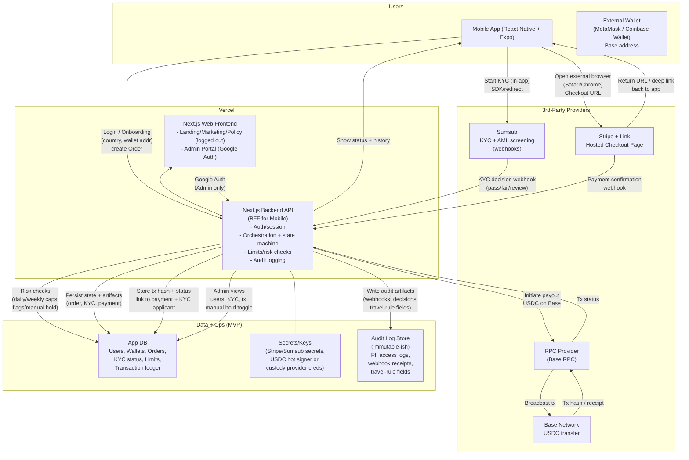
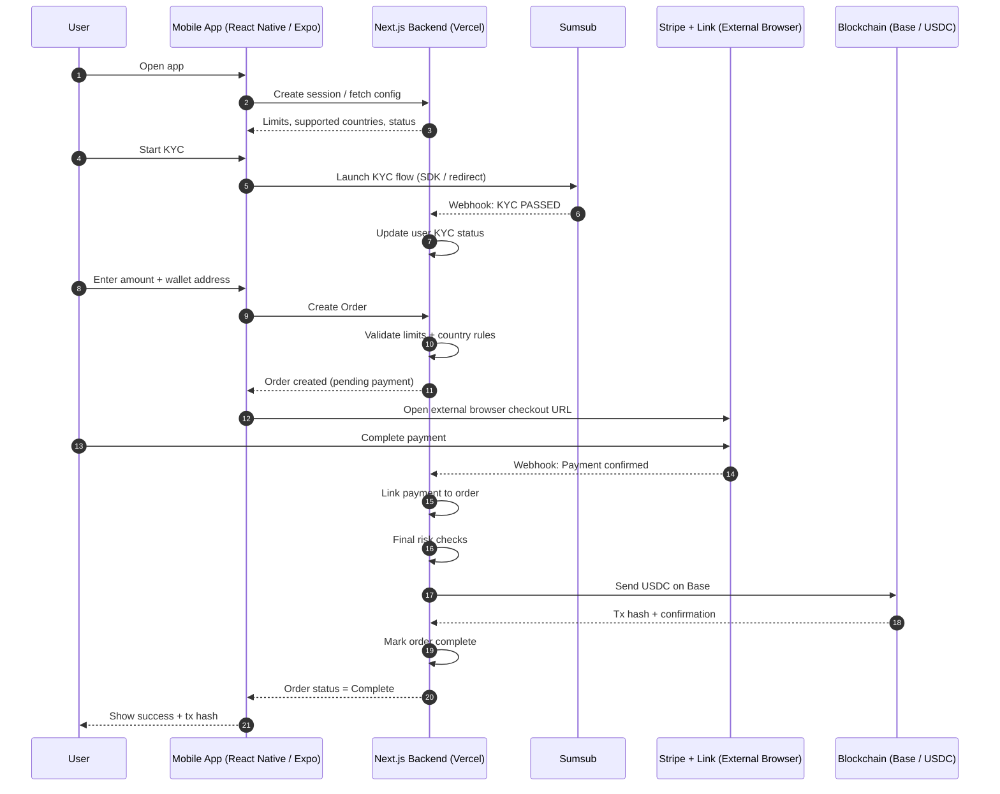
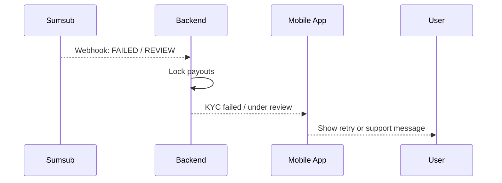
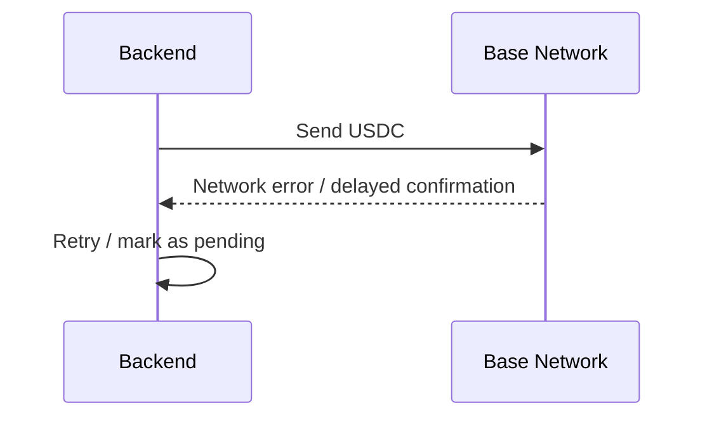

# Architecture

Below is a **high-level MVP architecture** that matches your stack (Next.js on Vercel + React Native/Expo), your compliance posture (FINTRAC MSB-aligned, always-on KYC), and the **mobile constraint**: **crypto purchase must occur outside the app** via an external browser checkout.

---

## High-level architecture diagram (MVP)

---

## What each box is responsible for

### 1) Mobile app (React Native + Expo)

- **Owns the user experience**: onboarding, wallet address capture, KYC initiation, transaction history.
- **Does not process the payment inside the app**. It only *launches* the checkout in the device’s external browser (Safari/Chrome), then returns via redirect/deep link.

### 2) Next.js on Vercel (frontend + backend)

- **Marketing/policy site** (logged out): important for trust and app review (“right paperwork, stamped”).
- **Admin portal** (logged in via Google auth): minimal ops surface, manual hold toggle, user/tx/KYC views.
- **Backend API (BFF for mobile)**: the “conductor” that ties everything together:
    - creates “orders”
    - receives Stripe and Sumsub webhooks
    - enforces limits + risk gates
    - triggers USDC payout
    - stores audit-ready artifacts (FINTRAC posture)

### 3) Stripe + Link (external hosted checkout)

- Checkout is **outside the mobile app** to reduce app store risk (no embedded WebView checkout).
- Stripe sends **webhooks** to your backend; the backend treats Stripe as the **fiat rail**, not the compliance perimeter.

### 4) Sumsub (KYC + AML)

- **Always-on KYC before payout**, regardless of amount, to simplify compliance and reduce edge cases.
- Sumsub sends **status webhooks** (pass/fail/review) to the backend.

### 5) USDC payout on Base

- **Non-custodial payout**: user provides a Base-compatible address; you send USDC one-way.
- Backend stores **tx hash** and links it to Stripe payment + Sumsub applicant for auditability/travel-rule-style association.

---

## MVP “state machine” (how the backend thinks)

This is the simple spine that keeps everything sane:

1. **Order Created** (user + wallet + amount + country)
2. **KYC Pending**
3. **KYC Passed** (or Failed / Review)
4. **Checkout Started** (checkout session created)
5. **Payment Confirmed** (Stripe webhook)
6. **Risk Gate** (limits, flags, manual hold)
7. **Payout Initiated**
8. **Payout Confirmed** (tx hash stored)
9. **Complete** (shown in transaction history)

This aligns cleanly with your PRD flow and compliance needs.

---

## Key design choices driven by mobile considerations

- **External browser checkout** is the big unlock: Mobile app triggers purchase → user pays in Safari/Chrome → deep link back.
- Keep wording and UX consistent with “financial transaction / on-ramp” rather than “in-app digital goods purchase.”
- “Compliance pages” live on the logged-out site and are linked from app metadata if needed.

---

Perfect. Let’s turn the architecture into a **time-ordered story**. Below is a **high-level sequence diagram** for the MVP that shows how control, money, and compliance signals move through the system. No code, no implementation trivia, just the choreography.

---

## MVP happy-path sequence diagram (primary flow)

---

## What this diagram is quietly doing right

- **KYC before money movement**
    
    No ambiguity. If KYC fails, the system never even offers checkout.
    
- **Payment outside the app**
    
    The mobile app never embeds checkout. It *hands the user off*, then waits for webhooks. This keeps you aligned with app store rules and reduces reviewer friction.
    
- **Backend as the single source of truth**
    
    The Next.js backend is the only component allowed to:
    
    - interpret Stripe webhooks
    - interpret KYC outcomes
    - initiate blockchain payouts
    
    The mobile app is a narrator, not an executor.
    

---

## Failure & edge-case sequences (compressed but important)

### 1) KYC fails or needs review

**Design intent:**

No partial states. A failed KYC cleanly halts the funnel.

---

### 2) Blockchain send fails or is delayed

**Design intent:**

Blockchain is asynchronous by nature. The user experience must tolerate “processing” states without panic.

---

## Conceptual takeaway (important)

Think of the MVP as **three clocks running at different speeds**:

1. **User clock** – taps, forms, confirmations (seconds)
2. **Compliance clock** – KYC decisions, limits, reviews (minutes to hours)
3. **Settlement clock** – card payments + blockchain finality (minutes)

Your backend is the **metronome** keeping those clocks in rhythm.

---